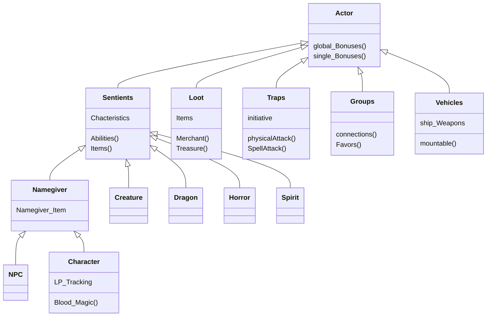

# Actors in Earthdawn

Actors are the base for every Roleplaying game. without them there would be no interaction, no Heros battling evil Horrors, no NPC holding important information. There are a lot of different types of Actors. The Earthdawn system contains ten different types of actors. Starting with the most important one, the Character, which is the actor used to create player characters, followed by an NPC which has more freedom in terms of the calculation of characteristics and other values. But there are a lot more:

* Character
* NPC
* Creature
* Spirit
* Horror
* Dragon
* Group
* Vehicle
* Trap
* Loot

The decision to have these many actor types was made due to their different behaviors. 

## Actor overview and connection

### Commonalities

As shown in the diagram the actors have some things in common and others differ. In the following chapter the Actor types and their Commonalities will be described in detail.

#### Actor (CommonTemplate)

the Base to all actor types is the Actor itself (CommonTemplate) this one extends the foundry core functionality of actors to the needs of the Earthdawn System. 
The CommonTemplate holds:
* global Bonuses (see {LINK})
* single Bonuses (see {LINK})

#### Sentient 

The Sentient actor (SentientTemplate) ...
The SentientTemplate holds:
* attributes (see {LINK})
* healthRate (see {LINK})
* characteristics (see {LINK})
* condition (see {LINK})
* devotion (see {LINK})
* encumbrance (see {LINK})
* initiative (see {LINK})
* karma (see {LINK})
* relations (see {LINK})

#### Namegiver 

The Namegiver actor (NamegiverTemplate)...
The NamegiverTemplate holds:
* languages (see {LINK})

#### Character 

The Character actor (PcData)...
The PcData holds:
* attributes (with values) (see {LINK})
* durabilityBonus (see {LINK})
* lp (see {LINK})
* legendPointsEarned (see {LINK})

#### NPC 

The NPC actor (NPCTemplate)...
The NPCTemplate holds:
* ... (see {LINK})

#### Creature 

The Creature actor (CreatureTemplate)...
The CreatureTemplate holds:
* ... (see {LINK})

#### Dragon 

The Dragon actor (DragonTemplate)...
The DragonTemplate holds:
* ... (see {LINK})

#### Horror 

The Horror actor (HorrorTemplate)...
The HorrorTemplate holds:
* ... (see {LINK})

#### Spirit 

The Spirit actor (SpiritTemplate)...
The SpiritTemplate holds:
* ... (see {LINK})

#### Loot 

The Loot actor (LootTemplate)...
The LootTemplate holds:
* ... (see {LINK})

#### Trap 

The Trap actor (TrapTemplate)...
The TrapTemplate holds:
* ... (see {LINK})

#### Group 

The Group actor (GroupTemplate)...
The GroupTemplate holds:
* ... (see {LINK})

#### Vehicle 

The Vehicle actor (VehicleTemplate)...
The VehicleTemplate holds:
* ... (see {LINK})
