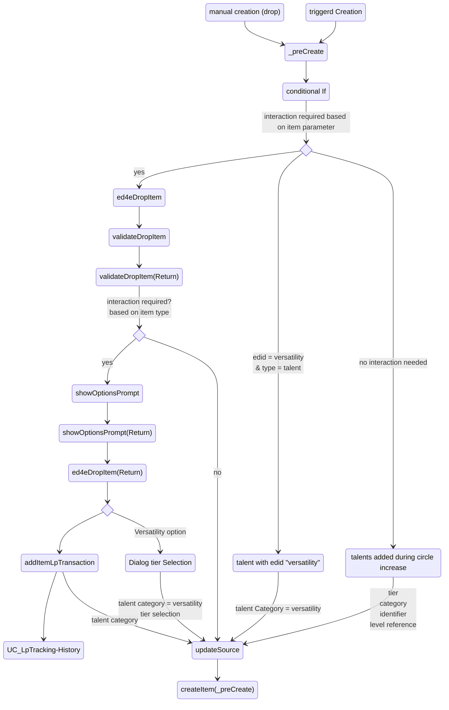

This use case covers all items which are dropped onto an actor document (Sheet). The [UF_ActorItems-preCreate](../User%20Functions/UF_AssignLpPrompt-preCreate.md) is responsible for triggering this use case or not. Based on the Actor type several items are able to be dropped to an actor sheet and some aren't. If an item type is not foreseen for the target actor type, a warning message appears, informing the user. If, on the other hand, the item can be added to the target actor type, two functions might be triggered.
1. validateDropItem
2. _showOptionsPrompt

ValidateDropItem is responsible for validation of Legendpoints.
_showOptionsPrompt is required for additional user interaction when the item is added to the actor (choosing a talent category, or tier etc.)

### Diagram

### Related User Functions

[UF_ActorItems-ed4eDropItem](../User%20Functions/UF_ActorItems/UF_ActorItems-ed4eDropItem.md)

[UF_ActorItems-validateDropItem](../User%20Functions/UF_ActorItems/UF_ActorItems-validateDropItem.md)

[UF_LpTracking-showOptionsPrompt](../User%20Functions/UF_LpTracking/UF_LpTracking-showOptionsPrompt.md)

[UF_ActorItems-preCreate](../User%20Functions/UF_ActorItems/UF_ActorItems-preCreate.md)

[UF_ActorItems-createEmbeddedDocuments](../User%20Functions/UF_ActorItems/UF_ActorItems-createEmbeddedDocuments.md)

[UF_ActorItems-findSourceTalent](../User%20Functions/UF_ActorItems/UF_ActorItems-findSourceTalent.md)

[UF_ActorItems-countKnacksForTalent](../User%20Functions/UF_ActorItems/UF_ActorItems-countKnacksForTalent.md)

### Related Test Coverage

| Test Coverage | Related Documentation |
|---------------|-----------------------|
| add skill | [[Test] - add skill to character](https://github.com/patrickmohrmann/earthdawn4eV2/issues/846) |
| add knack | [[Test] - add knack to character](https://github.com/patrickmohrmann/earthdawn4eV2/issues/845) |
| add devotion | [[Test] - add devotion to character](https://github.com/patrickmohrmann/earthdawn4eV2/issues/844) |
| add talents | [[Test] - add talent to character](https://github.com/patrickmohrmann/earthdawn4eV2/issues/835) |
| add talent with edid versatility | [[Test] - add talent with edid "versatility" to character](https://github.com/patrickmohrmann/earthdawn4eV2/issues/842) |
| add disciplines | [[Test] - add discipline to character](https://github.com/patrickmohrmann/earthdawn4eV2/issues/843) |
| add spell | [[Test] - add spells to character](https://github.com/patrickmohrmann/earthdawn4eV2/issues/841) |
| -- Later -- add binding secret | [TC_YYYYYY-XXXXX](https://github.com/patrickmohrmann/earthdawn4eV2/issues/) |
| -- Later -- add physical item --> with thread items| [TC_YYYYYY-XXXXX](https://github.com/patrickmohrmann/earthdawn4eV2/issues/) |
| -- Later -- add spell knack | [TC_YYYYYY-XXXXX](https://github.com/patrickmohrmann/earthdawn4eV2/issues/) |
| -- Later -- add thread item | [TC_YYYYYY-XXXXX](https://github.com/patrickmohrmann/earthdawn4eV2/issues/) |
| -- Later -- add effect | [[Test] - add effect to character](https://github.com/patrickmohrmann/earthdawn4eV2/issues/851) |
| -- Later -- add special ability | [[Test] - add special ability to character](https://github.com/patrickmohrmann/earthdawn4eV2/issues/849) |
| -- Later -- add path | [TC_YYYYYY-XXXXX](https://github.com/patrickmohrmann/earthdawn4eV2/issues/) |
| -- Later -- add questor | [TC_YYYYYY-XXXXX](https://github.com/patrickmohrmann/earthdawn4eV2/issues/) |

