Every physical item (armor, equipment, shield or weapon) has a status which defines the equipped state.
the following states are possible:
* owned
* carried
* equipped
* main hand
* off hand
* two hands
* tail 

armor, equipment and shields have the first three status options available, where the equipped status triggers calculations for:
* encumbrance
* Armor 
* defense 
* initiative 

weapons on the other hand have all 7 states available. the 7th status is limited only to namegivers with a tail though. 
based on the equipped status for the weapon, this weapon will be used for attack (or similar actions) which require a weapon. Melee weapons for example will check if there is a two handed weapon, if not it will take the main hand equipped weapon to attack. Second weapon on the other hand can only work if there is a weapon in the off hand etc. 

there are several special situation where one or the other status can work along side one another if the items have special values (see special cases in [UF_ActorItems-updateItemStates](../User%20Functions/UF_ActorItems-updateItemStates.md))

the equipment status can be changed using several mouse click options.
### Diagram

```mermaid
stateDiagram-v2
    classDef fromOutside font-style:italic,font-weight:bold,fill:lightyellow
    classDef foundryCore font-style:italic,font-weight:bold,fill: lightgreen
    classDef userFunction font-style:italic,font-weight:bold,fill:lightblue
    classDef userFunctionReturn font-style:italic,font-weight:bold,fill:aqua
    classDef dialog font-style:italic,font-weight:bold,fill:orange

    ###################### status #######################

    condition1: CONDITIONNAME1
    condition2: CONDITIONNAME1
    condition3: CONDITIONNAME1

    triggerAction1: TRIGGERACTION1
    triggerAction2: TRIGGERACTION2
    triggerAction3: TRIGGERACTION3

    userFunction1: USERFUNCTION1
    userFunction2: USERFUNCTION2
    userFunction3: USERFUNCTION3

    state1: STATE1
    state2: STATE2
    state3: STATE3

    dialog1: DIALOG1

    ####################### Decisions #######################

    state DECISION1 <<choice>>
    state DECISION2 <<choice>>
    state DECISION3 <<choice>>

    ######################## Colorations ######################

    triggerAction1:::fromOutside
    triggerAction2:::fromOutside
    triggerAction3:::fromOutside

    userFunction1:::userFunction
    userFunction2:::userFunction
    userFunction3:::userFunction

    dialog1:::dialog

    ##################### StateDiagram ########################
```

### Related User Functions

[UF_YYYYYY-XXXXX](../User%20Functions/UF_YYYYYY-XXXXX.md)

[UF_YYYYYY-XXXXX](../User%20Functions/UF_YYYYYY-XXXXX.md)

[UF_YYYYYY-XXXXX](../User%20Functions/UF_YYYYYY-XXXXX.md)

### Related Test Coverage

| Test Coverage | Related Documentation |
|---------------|-----------------------|
| Test case | [TC_YYYYYY-XXXXX](https://github.com/patrickmohrmann/earthdawn4eV2/issues/) |
| Test case | [TC_YYYYYY-XXXXX](https://github.com/patrickmohrmann/earthdawn4eV2/issues/) |
| Test case | [TC_YYYYYY-XXXXX](https://github.com/patrickmohrmann/earthdawn4eV2/issues/) |
| Test case | [TC_YYYYYY-XXXXX](https://github.com/patrickmohrmann/earthdawn4eV2/issues/) |
| Test case | [TC_YYYYYY-XXXXX](https://github.com/patrickmohrmann/earthdawn4eV2/issues/) |
| Test case | [TC_YYYYYY-XXXXX](https://github.com/patrickmohrmann/earthdawn4eV2/issues/) |
| Test case | [TC_YYYYYY-XXXXX](https://github.com/patrickmohrmann/earthdawn4eV2/issues/) |
| Test case | [TC_YYYYYY-XXXXX](https://github.com/patrickmohrmann/earthdawn4eV2/issues/) |
| Test case | [TC_YYYYYY-XXXXX](https://github.com/patrickmohrmann/earthdawn4eV2/issues/) |
| Test case | [TC_YYYYYY-XXXXX](https://github.com/patrickmohrmann/earthdawn4eV2/issues/) |

stateDiagram-v2
    classDef fromOutside font-style:italic,font-weight:bold,fill:lightyellow
    classDef foundryCore font-style:italic,font-weight:bold,fill: lightgreen
    classDef userFunction font-style:italic,font-weight:bold,fill:lightblue
    classDef userFunctionReturn font-style:italic,font-weight:bold,fill:aqua
    classDef dialog font-style:italic,font-weight:bold,fill:orange

    ###################### status #######################

    condition1: CONDITIONNAME1
    condition2: CONDITIONNAME1
    condition3: CONDITIONNAME1

    triggerAction1: deposit
    triggerAction2: carry
    triggerAction3: rotate forward
    triggerAction4: rotate backwards

    userFunction1: rotate
    userFunction2: deposit
    userFunction3: carry

    statusState1: owned
    statusState2: carried
    statusState3: equipped
    statusState4: main hand
    statusState5: off hand
    statusState6: Two handed
    statusState7: tail

    state1: armor
    state2: three status
    state3: equipment
    state5: shield
    state7: weapon
    state8: six status
    state9: seven status

    dialog1: DIALOG1

    ####################### Decisions #######################

    state itemTypeDecision <<choice>>
    state tailOption <<choice>>
    state DECISION3 <<choice>>

    ######################## Colorations ######################

    triggerAction1:::fromOutside
    triggerAction2:::fromOutside
    triggerAction3:::fromOutside
    triggerAction4:::fromOutside

    userFunction1:::userFunction
    userFunction2:::userFunction
    userFunction3:::userFunction
    userFunction4:::userFunction

    dialog1:::dialog

    ##################### StateDiagram ########################

    First
    
    First --> Third

    state First 
    state threeOptions {
        statusState1
        statusState1 --> statusState2
        statusState2 --> statusState3
        statusState3 --> statusState1
    }
    state Third {
        [*] --> thi
        thi --> [*]
    }

    state Third {
        [*] --> thi
        thi --> [*]
    }

    state Third {
        [*] --> thi
        thi --> [*]
    }

userFunction1 --> threeOptions
    