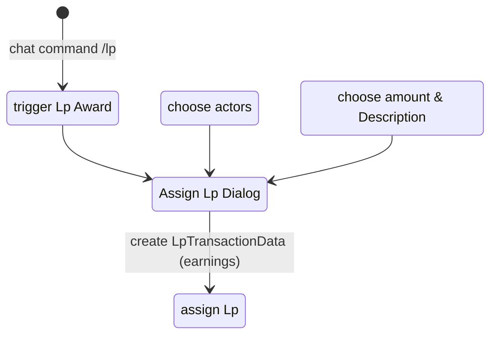

the chat command /lp triggers a dialog to assign legend points to actors. An input field for Legend points and a description can be filled. This dialog will show all actors which are either

* configured for an active player
* configured for an inactive player
* owned by a player
configured Actors for an active player are preselected. All selected actor will receive the legend points with the description on confirmation.

### Diagram

### Related User Functions

[UF_ChatCommand-triggerLPAward](../User%20Functions/UF_ChatCommand/UF_ChatCommand-triggerLPAward.md)

[UF_AssignLpPrompt-assignLp](../User%20Functions/UF_AssignLpPrompt-assignLp.md)

[UF_AssignLpPrompt-prepareContext](../User%20Functions/UF_AssignLpPrompt-prepareContext.md)

[UF_AssignLpPrompt-onFormSubmission](../User%20Functions/UF_AssignLpPrompt-onFormSubmission.md)

[UF_AssignLpPrompt-assignLpPrompt](../User%20Functions/UF_AssignLpPrompt-assignLpPrompt.md)

[UF_LpTracking-addLpTransaction](../User%20Functions/UF_LpTracking/UF_LpTracking-addLpTransaction.md)

### Related Test Coverage

[TC_AssignLpPrompt-assignLpPrompt](https://github.com/patrickmohrmann/earthdawn4eV2/issues/848) 

[TC_ChatCommand-triggerLPAward](https://github.com/patrickmohrmann/earthdawn4eV2/) 

[TC_LpTracking-addLpTransaction-1](https://github.com/patrickmohrmann/earthdawn4eV2/issues/831) 

