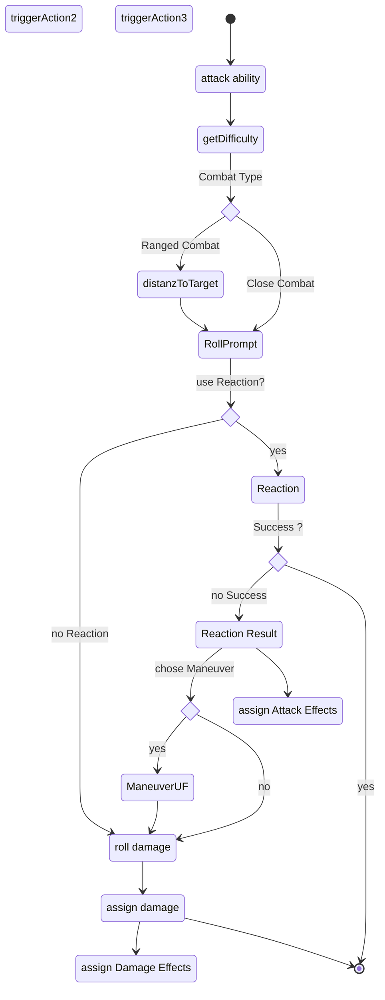

activating an ability with the roll type set to **attack** triggers the attack roll with the difficulty [getDifficulty](http:...) of the selected target. The equipped item (see [itemStatus](http:...)) defines which weapon is currently hold and can be used for an attack.  
If the equipped weapon is fitting to the distance of the target and the roll ability a roll Prompt appears to roll the ability. 
a chat message appears showing the result and providing the possibility to react to the attack as the defender. 
If the Reaction is successful the attack ends. Otherwise the attacker has the option to chose maneuvers based on his extra successes and/or triggers the damage Roll. the successful attack also provides the option to assign Active Effects. 
the damage result can be assigned to the target as well as active effects which require damage. The damage is lessend by the targets armor.

### Diagram

### Related User Functions

[UF_Combat-reaction](../User%20Functions/UF_Combat-reaction.md)

[UF_Combat-maneuver](../User%20Functions/UF_Combat-maneuver.md)

[UF_Combat-rollAttack](../User%20Functions/UF_Combat-rollAttack.md)

[UF_Combat-assignAttackEffects](../User%20Functions/UF_Combat-assignAttackEffects.md)

[UF_Combat-assignDamageEffects](../User%20Functions/UF_Combat-assignDamageEffects.md)

[UF_Combat-rollDamage](../User%20Functions/UF_Combat-rollDamage.md)

[UF_Combat-assignDamage](../User%20Functions/UF_Combat-assignDamage.md)

### Related Test Coverage

| Test Coverage | Related Documentation |
|---------------|-----------------------|
| Test case | [TC_YYYYYY-XXXXX](https://github.com/patrickmohrmann/earthdawn4eV2/issues/) |
| Test case | [TC_YYYYYY-XXXXX](https://github.com/patrickmohrmann/earthdawn4eV2/issues/) |
| Test case | [TC_YYYYYY-XXXXX](https://github.com/patrickmohrmann/earthdawn4eV2/issues/) |
| Test case | [TC_YYYYYY-XXXXX](https://github.com/patrickmohrmann/earthdawn4eV2/issues/) |
| Test case | [TC_YYYYYY-XXXXX](https://github.com/patrickmohrmann/earthdawn4eV2/issues/) |
| Test case | [TC_YYYYYY-XXXXX](https://github.com/patrickmohrmann/earthdawn4eV2/issues/) |
| Test case | [TC_YYYYYY-XXXXX](https://github.com/patrickmohrmann/earthdawn4eV2/issues/) |
| Test case | [TC_YYYYYY-XXXXX](https://github.com/patrickmohrmann/earthdawn4eV2/issues/) |
| Test case | [TC_YYYYYY-XXXXX](https://github.com/patrickmohrmann/earthdawn4eV2/issues/) |
| Test case | [TC_YYYYYY-XXXXX](https://github.com/patrickmohrmann/earthdawn4eV2/issues/) |

