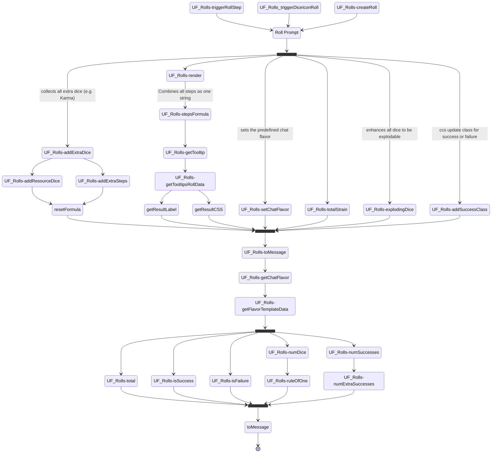

This Use Case covers the handling of Roll data. it is triggered by all use cases which roll any dice. Based on the input the triggering function provide this use case evaluates the result. Success, failure, extra successes are only the obvious validations, but this function does also handle the explosion of dice, the handling of additional dice like karma, devotions or similar options. 

Based on the input the information needed to show all relevant details are prepared together with the right chat message file.

### Diagram

### Related User Functions

[UF_Rolls-total](../User%20Functions/UF_Rolls/UF_Rolls-total.md)

[UF_Rolls-ruleOfOne](../User%20Functions/UF_Rolls/UF_Rolls-ruleOfOne.md)

[UF_Rolls-isSuccess](../User%20Functions/UF_Rolls/UF_Rolls-isSuccess.md)

[UF_Rolls-isFailure](../User%20Functions/UF_Rolls/UF_Rolls-isFailure.md)

[UF_Rolls-numDice](../User%20Functions/UF_Rolls/UF_Rolls-numDice.md)

[UF_Rolls-totalStrain](../User%20Functions/UF_Rolls/UF_Rolls-totalStrain.md)

[UF_Rolls-numSuccesses](../User%20Functions/UF_Rolls/UF_Rolls-numSuccesses.md)

[UF_Rolls-numExtraSuccesses](../User%20Functions/UF_Rolls/UF_Rolls-numExtraSuccesses.md)

[UF_Rolls-getChatFlavor](../User%20Functions/UF_Rolls/UF_Rolls-getChatFlavor.md)

[UF_Rolls-setChatFlavor](../User%20Functions/UF_Rolls/UF_Rolls-setChatFlavor.md)

[UF_Rolls-stepFormula](../User%20Functions/UF_Rolls/UF_Rolls-stepFormula.md)

[UF_Rolls-explodingDice](../User%20Functions/UF_Rolls/UF_Rolls-explodingDice.md)

[UF_Rolls-addExtraDice](../User%20Functions/UF_Rolls/UF_Rolls-addExtraDice.md)

[UF_Rolls-addResourceDice](../User%20Functions/UF_Rolls/UF_Rolls-addResourceDice.md)

[UF_Rolls-addExtraSteps](../User%20Functions/UF_Rolls/UF_Rolls-addExtraSteps.md)

[UF_Rolls-getFlavorTemplateData](../User%20Functions/UF_Rolls/UF_Rolls-getFlavorTemplateData.md)

[UF_Rolls-addSuccessClass](../User%20Functions/UF_Rolls/UF_Rolls-addSuccessClass.md)

[UF_Rolls-getTooltipsRollData](../User%20Functions/UF_Rolls/UF_Rolls-getTooltipsRollData.md)

[UF_Rolls-getTooltip](../User%20Functions/UF_Rolls/UF_Rolls-getTooltip.md)

[UF_Rolls-render](../User%20Functions/UF_Rolls/UF_Rolls-render.md)

[UF_Rolls-toMessage](../User%20Functions/UF_Rolls/UF_Rolls-toMessage.md)

### Related Test Coverage

- every Flavor file with every option. so one test per flavor should cover all.

are thread weaving und spellcasting different from ability? probably at least spellcasting because it triggers effect options like attack. thread weaving might not.

| Test Coverage | Related Documentation |
|---------------|-----------------------|
| Ability rolls | [[Test] - Ability Rolls](https://github.com/patrickmohrmann/earthdawn4eV2/issues/936) |
| arbitrary Rolls | [[Test] - Roll from Journal ](https://github.com/patrickmohrmann/earthdawn4eV2/issues/932) |
| arbitrary Rolls | [[Test] - roll from Chat](https://github.com/patrickmohrmann/earthdawn4eV2/issues/933) |
| arbitrary Rolls | [[Test] - System Setting Step tables](https://github.com/patrickmohrmann/earthdawn4eV2/issues/386) |
| Attack rolls | [[Test] - Attack Rolls](https://github.com/patrickmohrmann/earthdawn4eV2/issues/937) |
| Attribute Rolls | [[Test] - Attribute Roll](https://github.com/patrickmohrmann/earthdawn4eV2/issues/938) |
| damage Rolls | [[Test] - Damage roll](https://github.com/patrickmohrmann/earthdawn4eV2/issues/939) |
| effect Rolls | [[Test] - effect roll](https://github.com/patrickmohrmann/earthdawn4eV2/issues/940) |
| Half magic Rolls | [[Test] - roll half magic](https://github.com/patrickmohrmann/earthdawn4eV2/issues/941) |
| Initiative Rolls | [[Test] - initiative roll](https://github.com/patrickmohrmann/earthdawn4eV2/issues/942) |
| Spellcasting Rolls | [[Test] - Spellcasting roll](https://github.com/patrickmohrmann/earthdawn4eV2/issues/943) |
| Thread weaving Rolls | [[Test] - weave threads](https://github.com/patrickmohrmann/earthdawn4eV2/issues/944) |
| Basic Rolls (rule of one, success, failure, exploding etc.) | [[Test] - Basic rolls ](https://github.com/patrickmohrmann/earthdawn4eV2/issues/945) |

