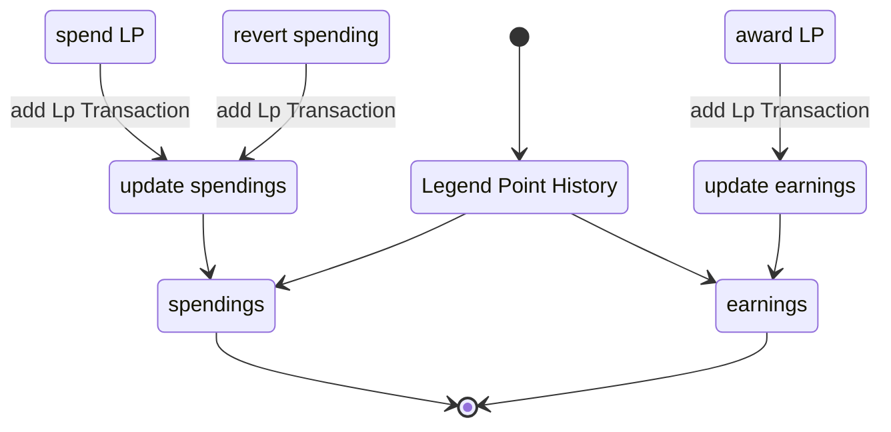

This use case covers the tracking of Legend points of an actor, every add, edit or deletion will be tracked. Two different overviews are available in the History prompt, showing an History of all earned legend Points and another history shows all spendings of legend points. Each of the tabs have a check to show deletions as well. if this is checked, the deleted history entries will be shown.

### Diagram

### Related User Functions

[UF_LpTracking-addLpTransaction](../User%20Functions/UF_LpTracking/UF_LpTracking-addLpTransaction.md)

[UF_LpTracking-legendpointHistory](../User%20Functions/UF_LpTracking/UF_LpTracking-legendpointHistory.md)

[UF_LpTracking-toggleTransactionDetails](../User%20Functions/UF_LpTracking/UF_LpTracking-toggleTransactionDetails.md)

[UF_LpTracking-status](../User%20Functions/UF_LpTracking/UF_LpTracking-status.md)

### Related Test Coverage

| Test Coverage | Related Documentation |
|---------------|-----------------------|
|  | [[Test] - assign lp to character](https://github.com/patrickmohrmann/earthdawn4eV2/issues/850)  |
|  | [[Test] - add spells to character](https://github.com/patrickmohrmann/earthdawn4eV2/issues/841)  |
|  | [[Test] - add knack to character](https://github.com/patrickmohrmann/earthdawn4eV2/issues/845)  |
|  | [[Test] - upgrade talent](https://github.com/patrickmohrmann/earthdawn4eV2/issues/XXX)  |
|  | [[Test] - upgrade attribute](https://github.com/patrickmohrmann/earthdawn4eV2/issues/XXX)  |
|  | [[Test] - upgrade skill](https://github.com/patrickmohrmann/earthdawn4eV2/issues/XXX)  |
|  | [[Test] - upgrade devotion](https://github.com/patrickmohrmann/earthdawn4eV2/issues/XXX)  |
|  | [[Test] - upgrade thread](https://github.com/patrickmohrmann/earthdawn4eV2/issues/XXX)  |

 

