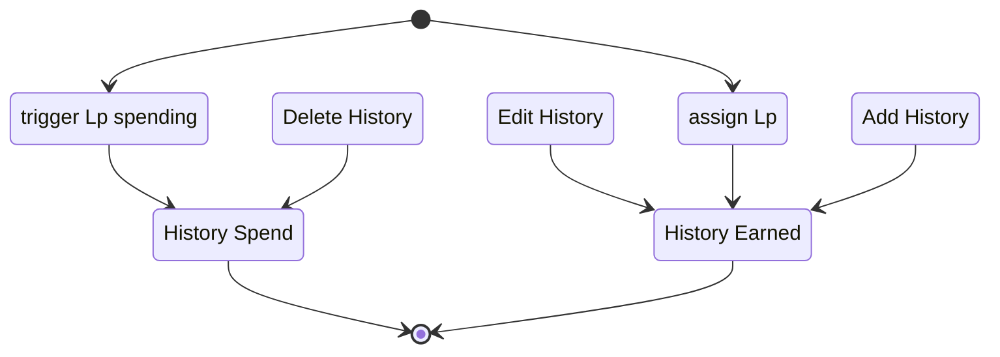

The Use Case UC_LpTracking-History covers the tracking of Legend points of an actor, every add, edit or deletion will be tracked. Two different overviews are available in the History prompt, showing an History of all earned legend Points and another History shows all spendings of legend Points. Each of the tabs have a check to show deletions as well. if this is checked, the deleted history entries will be shown.

#### Diagram

##### Related User Functions

* [UF-LpTracking_assignLp](#UF-LpTracking_assignLp)
* [UF_LpTracking-addLpTransaction](#UF_LpTracking-addLpTransaction)
* [UF_LpTracking-legendPointHistoryLog](#UF_LpTracking-legendPointHistoryLog)
* [UF_LpTracking-legendPointHistorySpend](#UF_LpTracking-legendPointHistorySpend)
* [UF_LpTracking-legendPointHistoryEarned](#UF_LpTracking-legendPointHistoryEarned)
* [UF_LpTracking-deleteLegendPointHistoryEntries](#UF_LpTracking-deleteLegendPointHistoryEntries)
* [UF_LpTracking-editLegendPointHistoryEntries](#UF_LpTracking-editLegendPointHistoryEntries)