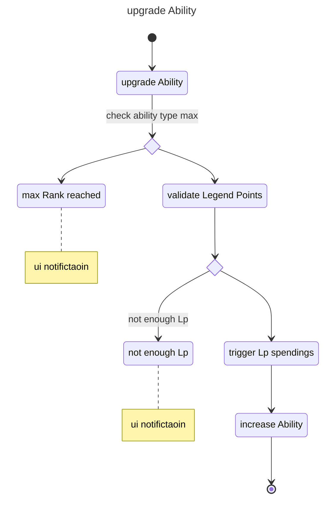

This use case is responsible for upgrading devotions, skills and talents. all abilities have an upgrade button (arrow up) on the list view which will start the upgrade process, by checking if the ability has not yet reached the maximum level (devotions 12, skills 10 and talents 15). A prompt will appear after this check with information about the required and current legend points. A Button "spend Lp" will upgrade the ability by spending the required Legend Points if they are available, otherwise it will not increase the ability. The Free button will enhance the ability without spending any legend points. An LpTransactionData will be created in either case.

### Diagram

### Related User Functions

[UF_LpTracking-upgradeAbility](../User%20Functions/UF_LpTracking/UF_LpTracking-upgradeAbility.md)

[UF_LpTracking-validateAbilityUpgrade](../User%20Functions/UF_LpTracking/UF_LpTracking-validateAbilityUpgrade.md)

[UF_LpTracking-addLpTransaction](../User%20Functions/UF_LpTracking/UF_LpTracking-addLpTransaction.md)

[UF_LpTracking-showOptionsPrompt](../User%20Functions/UF_LpTracking/UF_LpTracking-showOptionsPrompt.md)

### Related Test Coverage

[TC_LpTracking-upgradeAbility-1](https://github.com/patrickmohrmann/earthdawn4eV2/issues/837) 

[TC_LpTracking-upgradeAbility-2](https://github.com/patrickmohrmann/earthdawn4eV2/issues/836) 

[TC_LpTracking-validateAbilityUpgrade-1](https://github.com/patrickmohrmann/earthdawn4eV2/issues/838) 

[TC_LpTracking-validateAbilityUpgrade-2](https://github.com/patrickmohrmann/earthdawn4eV2/issues/840) 

[TC_LpTracking-validateAbilityUpgrade-3](https://github.com/patrickmohrmann/earthdawn4eV2/issues/839) 

[TC_LpTracking-showOptionsPrompt-add skill/devotion](https://github.com/patrickmohrmann/earthdawn4eV2/issues/841) 

[TC_LpTracking-showOptionsPrompt-add versatility](https://github.com/patrickmohrmann/earthdawn4eV2/issues/842) 

[TC_LpTracking-showOptionsPrompt-add versatility choice](https://github.com/patrickmohrmann/earthdawn4eV2/issues/843) 

[TC_LpTracking-showOptionsPrompt-increase ability free](https://github.com/patrickmohrmann/earthdawn4eV2/issues/844) 

[TC_LpTracking-showOptionsPrompt-increase ability lp](https://github.com/patrickmohrmann/earthdawn4eV2/issues/845) 

[TC_LpTracking-showOptionsPrompt-cancel](https://github.com/patrickmohrmann/earthdawn4eV2/issues/846) 

[TC_LpTracking-addLpTransaction-2](https://github.com/patrickmohrmann/earthdawn4eV2/issues/832) 
