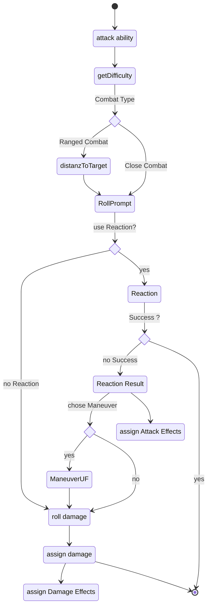

tbd

### Diagram

### Related User Functions

[UF_Combat-reaction](../User%20Functions/UF_Combat-reaction.md)

[UF_Combat-maneuver](../User%20Functions/UF_Combat-maneuver.md)

[UF_Combat-rollAttack](../User%20Functions/UF_Combat-rollAttack.md)

[UF_Combat-assignAttackEffects](../User%20Functions/UF_Combat-assignAttackEffects.md)

[UF_Combat-assignDamageEffects](../User%20Functions/UF_Combat-assignDamageEffects.md)

[UF_Combat-rollDamage](../User%20Functions/UF_Combat-rollDamage.md)

[UF_Combat-assignDamage](../User%20Functions/UF_Combat-assignDamage.md)

[UC_ChatMessage-create](../User%20Functions/UC_ChatMessage-create.md)

[UC_ChatMessage-getHTML](../User%20Functions/UC_ChatMessage-getHTML.md)

[UC_ChatMessage-onCreate](../User%20Functions/UC_ChatMessage-onCreate.md)

[UC_ChatMessage-onReaction](../User%20Functions/UC_ChatMessage-onReaction.md)

[UC_ChatMessage-updateChatMessage](../User%20Functions/UC_ChatMessage-updateChatMessage.md)

[UC_Rolls-attackSubstitude](../User%20Functions/UC_Rolls-attackSubstitude.md)

[UC_Rolls-targetReactions](../User%20Functions/UC_Rolls-targetReactions.md)

[UC_Settings-automaticAmmunitionTracking](../User%20Functions/UF_Settings-automaticAmmunitionTracking.md)

[UC_Settings-automaticRangeCalculation](../User%20Functions/UF_Settings-automaticRangeCalculation.md)

### Related Test Coverage

| Test Coverage | Related Documentation |
|---------------|-----------------------|
| Attack all Actor types | [[Test - XXXXX]](https://github.com/patrickmohrmann/earthdawn4eV2/issues/) |
| Attack with Reaction | [[Test - XXXXX]](https://github.com/patrickmohrmann/earthdawn4eV2/issues/) |
| Attack with Maneuver | [[Test - XXXXX]](https://github.com/patrickmohrmann/earthdawn4eV2/issues/) |
| Attack with Missile | [[Test - XXXXX]](https://github.com/patrickmohrmann/earthdawn4eV2/issues/) |
| Attack with Throwing Weapon | [[Test - XXXXX]](https://github.com/patrickmohrmann/earthdawn4eV2/issues/) |
| Attack unarmed | [[Test - XXXXX]](https://github.com/patrickmohrmann/earthdawn4eV2/issues/) |
| Attack with substitude | [[Test - XXXXX]](https://github.com/patrickmohrmann/earthdawn4eV2/issues/) |
| Attack with Tail | [[Test - XXXXX]](https://github.com/patrickmohrmann/earthdawn4eV2/issues/) |

