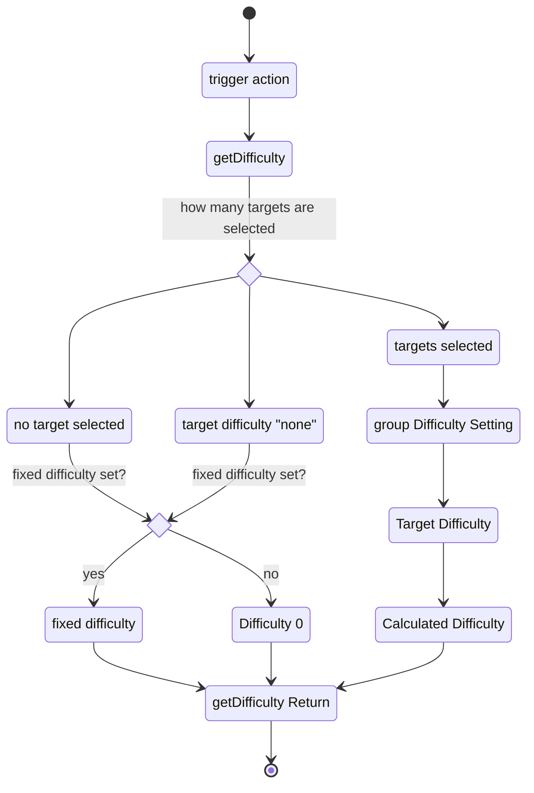

The calculation of difficulty is crucial for the earthdawn system. All action test are rolled against a difficulty. This use case describes how the difficulty is set.

in general there are three values which primarily influence the difficulty calculation:
* target difficulty
* group difficulty
* fixed difficulty

the target difficulty is a choice of the characteristic of the target(s).

the group difficulty is a choice how the difficulty shall be affected if more than one target is selected

fixed difficulty defines a difficulty for actions without a dedicated target defense.

### Diagram

### Related User Functions

[UF_PhysicalItems-getAggregatedDefense](../User%20Functions/UF_Physicalitems/UF_Physicalitems-getAggregatedDefense.md)

[UF_PhysicalItems-getDifficulty](../User%20Functions/UF_Physicalitems/UF_Physicalitems-getDifficulty.md)

### Related Test Coverage

| Test Coverage | Related Documentation |
|---------------|-----------------------|
| Test case | [[Test] - action with single target](https://github.com/patrickmohrmann/earthdawn4eV2/issues/862) | 
| Test case | [[Test] - action against multiple targets](https://github.com/patrickmohrmann/earthdawn4eV2/issues/863) |