# Healing Aids
Healing Aids are a sub type of physical items, which are used to support the recovery of actors. There are several different healing aids available which all work slightly different.  

Booster Potions e.g. provide a +8 bonus to the next recovery test. while a Healing potion heals 1 wound and provides an instand recovery test if the user does not has any recovery tests left. And there are other options as well. 

in addition to the simple healing aids, there are also aids, which support the recovery or resistance against poisons and or diseases. 

to cover all these different options there are some settings in the equipment items, which allow the different options to work. the following settings are available in any equipment. They will be made available in the details tab after checking the **usable Item** option.  

* recovery property value 
* arbitrary Step ???
* heals a wound
* recovery Bonus ??? same as arbitrary???
* Poison / disease resistance Bonus
* provide free Recovery test
* recovery test needed?

#### recovery property value 
the recovery property value is an option to select the usage or requirement for recovery tests. Several Abilities or items use or enhance the recovery test and recovery step. Some of them use a recovery test if one is available, others can't or can be used without one. This drop down option provides with the option.

----> maybe make separate parameter ???
| recovery property Value  | description | Recovery required | Step | roll type|
| ------------- | ------------- | ------------- | ------------- | ------------- |
| 0  | not a healing item | no  | no  | none  |
| 1  | pure healing  | no | arbitrary step  | recovery |
| 2  | Booster Potion  | yes  | arbitrary step + Toughness  | recovery  |
| 3  | Healing Potion | yes/no | arbitrary step + Toughness or arbitrary step  | recovery   |
| 4  | Fire blood  | yes | ability test  | recovery ability |
| 5 | Wood skin  | yes  | ability test  | ability  |

#### arbitrary Step

this value is the step bonus of the Healing aid, which will either added to the recovery bonus on usage, or used as the recovery step itself based on the recovery property value

#### heals a wound

this number field indicates, how many wounds will be healed instantly if the item is used.

#### recovery Bonus

this is a global bonus which contains the total bonus for the next recovery test. This value is - usually - set to 0 after a recovery test is made. There are some actions which do not take any bonus but still work as recovery test, those will not reduce or reset this value.

#### Poison / disease resistance Bonus

this is a global bonus which contains a total bonus for the next resistance test against poison or disease. This value is set to 0 after the next resistance test against poison or disease is made.

#### provide free Recovery test

this boolean field provides a free recovery test if the actor has none left.

#### recovery test needed?

this number field resembles the number of required recovery tests the user needs to have to fulfill the action.

### Diagram

```mermaid
stateDiagram-v2
    classDef fromOutside font-style:italic,font-weight:bold,fill:lightyellow
    classDef foundryCore font-style:italic,font-weight:bold,fill: lightgreen
    classDef useCase font-style:italic,font-weight:bold,color:white,fill: green
    classDef userFunction font-style:italic,font-weight:bold,fill:lightblue
    classDef userFunctionReturn font-style:italic,font-weight:bold,fill:aqua
    classDef dialog font-style:italic,font-weight:bold,fill:orange

    ###################### status #######################

    condition1: CONDITIONNAME1
    condition2: CONDITIONNAME1
    condition3: CONDITIONNAME1

    triggerAction1: attack ability
    triggerAction2: TRIGGERACTION2
    triggerAction3: TRIGGERACTION3

    getDifficulty: getDifficulty
    ManeuverUC: USERFUNCTION2
    ReactionUC: Reaction
    assignDamageEffects: assign Damage Effects
    assignAttackEffects: assign Attack Effects
    rollDamage: roll damage
    AssignDamage: assign damage

    ReactionResult: Reaction Result
    state3: STATE3

    dialog1: DIALOG1

    ####################### Decisions #######################

    state combatType <<choice>>
    state Reaction <<choice>>
    state ReactionSuccess <<choice>>
    state choseManeuver <<choice>>

    ######################## Colorations ######################

    triggerAction1:::fromOutside
    triggerAction2:::fromOutside
    triggerAction3:::fromOutside

    getDifficulty:::userFunction
    ReactionUC:::userFunction
    ManeuverUF:::userFunction
    rollDamage:::userFunction
    assignAttackEffects:::userFunction
    assignDamageEffects:::userFunction
    AssignDamage:::userFunction

    RollPrompt:::dialog

##################### StateDiagram ########################

```

### Related User Functions

[UF_PhysicalItems-onRollEquipment](../User%20Functions/UF_PhysicalItems-onRollEquipment.md)

[UF_PhysicalItems-rollEquipment](../User%20Functions/UF_PhysicalItems-rollEquipment.md)

[UF_PhysicalItems-XXXXX](../User%20Functions/UF_PhysicalItems-XXXXX.md)

[UF_PhysicalItems-XXXXX](../User%20Functions/UF_PhysicalItems-XXXXX.md)

### Related Test Coverage

| Test Coverage | Related Documentation |
|---------------|-----------------------|
| Test case | [TC_YYYYYY-XXXXX](https://github.com/patrickmohrmann/earthdawn4eV2/issues/) |
| Test case | [TC_YYYYYY-XXXXX](https://github.com/patrickmohrmann/earthdawn4eV2/issues/) |
| Test case | [TC_YYYYYY-XXXXX](https://github.com/patrickmohrmann/earthdawn4eV2/issues/) |
| Test case | [TC_YYYYYY-XXXXX](https://github.com/patrickmohrmann/earthdawn4eV2/issues/) |
| Test case | [TC_YYYYYY-XXXXX](https://github.com/patrickmohrmann/earthdawn4eV2/issues/) |
| Test case | [TC_YYYYYY-XXXXX](https://github.com/patrickmohrmann/earthdawn4eV2/issues/) |
| Test case | [TC_YYYYYY-XXXXX](https://github.com/patrickmohrmann/earthdawn4eV2/issues/) |
| Test case | [TC_YYYYYY-XXXXX](https://github.com/patrickmohrmann/earthdawn4eV2/issues/) |
| Test case | [TC_YYYYYY-XXXXX](https://github.com/patrickmohrmann/earthdawn4eV2/issues/) |
| Test case | [TC_YYYYYY-XXXXX](https://github.com/patrickmohrmann/earthdawn4eV2/issues/) |

