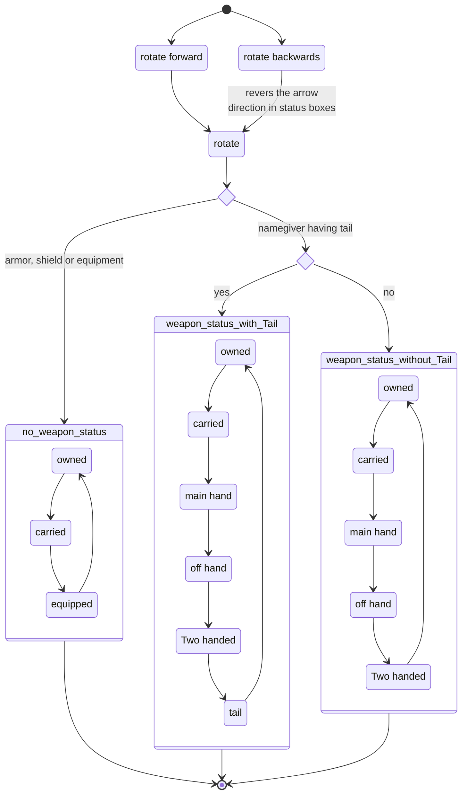
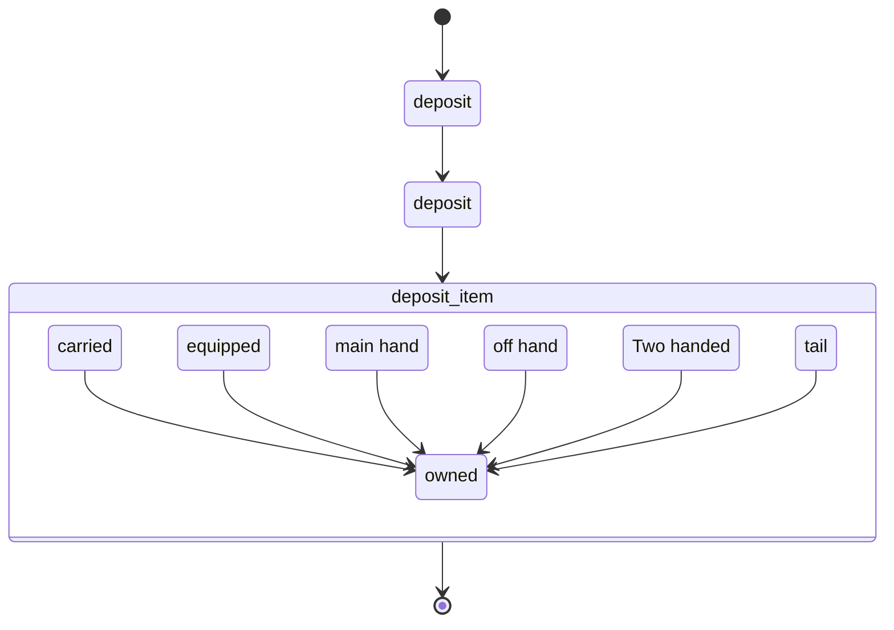
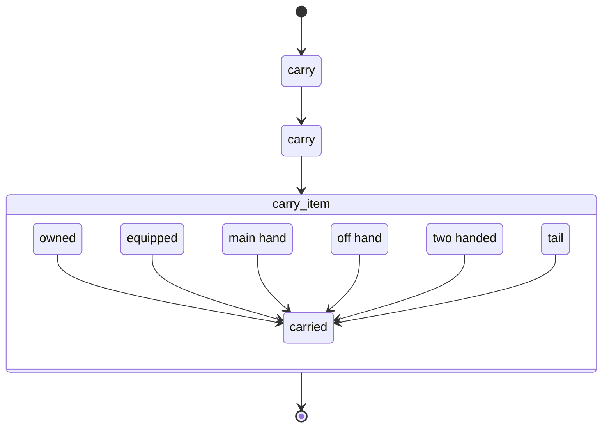

Every physical item (armor, equipment, shield or weapon) has a status which defines the equipped state.
the following states are possible:
* owned
* carried
* equipped
* main hand
* off hand
* two hands
* tail 

armor, equipment and shields have the first three status options available, where the equipped status triggers calculations for:
* encumbrance
* Armor 
* defense 
* initiative 

weapons on the other hand have all 7 states available. the 7th status is limited only to namegivers with a tail though. 
based on the equipped status for the weapon, this weapon will be used for attack (or similar actions) which require a weapon. Melee weapons for example will check if there is a two handed weapon, if not it will take the main hand equipped weapon to attack. Second weapon on the other hand can only work if there is a weapon in the off hand etc. 

there are several special situation where one or the other status can work along side one another if the items have special values (see special cases in [UF_PhysicalItems-updateItemStates](../User%20Functions/UF_Physicalitems/UF_Physicalitems-updateItemStates.md))

the equipment status can be changed using several mouse click options.
* left-click & right-click (see [UF_PhysicalItems-rotateItemStatus](../User%20Functions/UF_Physicalitems/UF_Physicalitems-rotateItemStatus.md))
* shift-left-click (see [UF_PhysicalItems-carry](../User%20Functions/UF_Physicalitems/UF_Physicalitems-carry.md))
* middle-click (see [UF_PhysicalItems-deposit](../User%20Functions/UF_Physicalitems/UF_Physicalitems-deposit.md))

### Diagram

#### Rotate status

#### deposit status

#### carry status

### Related User Functions

[UF_PhysicalItems-deposit](../User%20Functions/UF_Physicalitems/UF_Physicalitems-deposit.md)

[UF_PhysicalItems-carry](../User%20Functions/UF_Physicalitems/UF_Physicalitems-carry.md)

[UF_PhysicalItems-onChangeItemStatus](../User%20Functions/UF_Physicalitems/UF_Physicalitems-onChangeItemStatus.md)

[UF_PhysicalItems-updateItemStates](../User%20Functions/UF_Physicalitems/UF_Physicalitems-updateItemStates.md)

[UF_PhysicalItems-rotateItemStatus](../User%20Functions/UF_Physicalitems/UF_Physicalitems-rotateItemStatus.md)

### Related Test Coverage

| Test Coverage | Related Documentation |
|---------------|-----------------------|
| Test case | [TC_YYYYYY-XXXXX](https://github.com/patrickmohrmann/earthdawn4eV2/issues/) |
| Test case | [TC_YYYYYY-XXXXX](https://github.com/patrickmohrmann/earthdawn4eV2/issues/) |
| Test case | [TC_YYYYYY-XXXXX](https://github.com/patrickmohrmann/earthdawn4eV2/issues/) |
| Test case | [TC_YYYYYY-XXXXX](https://github.com/patrickmohrmann/earthdawn4eV2/issues/) |
| Test case | [TC_YYYYYY-XXXXX](https://github.com/patrickmohrmann/earthdawn4eV2/issues/) |
| Test case | [TC_YYYYYY-XXXXX](https://github.com/patrickmohrmann/earthdawn4eV2/issues/) |
| Test case | [TC_YYYYYY-XXXXX](https://github.com/patrickmohrmann/earthdawn4eV2/issues/) |
| Test case | [TC_YYYYYY-XXXXX](https://github.com/patrickmohrmann/earthdawn4eV2/issues/) |
| Test case | [TC_YYYYYY-XXXXX](https://github.com/patrickmohrmann/earthdawn4eV2/issues/) |
| Test case | [TC_YYYYYY-XXXXX](https://github.com/patrickmohrmann/earthdawn4eV2/issues/) |
