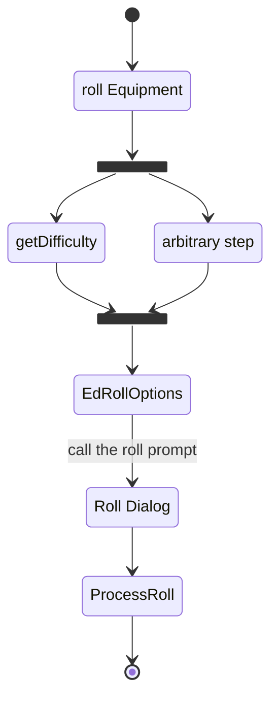

<Description>

some items like healing potions or some thread items can be used without the need of an ability. For those situations, every physical item has the **usable item** flag in the details tab. If this check is set, usually several options will appear, asking for difficulty settings (see [UC_PhysicalItems-difficultyCalculation](../User%20Cases/UC_PhysicalItems-difficultyCalculation.md) for more details), recovery action or an arbitrary step which will be rolled on usage. Equipment items in particular have an addional optino "consumable" which will **NOT IMPLEMENTED YET SEE #632 & #210** reduce the amount on usage.

the item will from now on show a dice symbol while hovering over the entry of the actor. By clicking the dice symbol, the roll is initiated (see [UC_PhysicalItems-onEquipmentRoll](../User%20Function/UC_PhysicalItems-onEquipmentRoll.md)). After the roll is initiated, the roll data will be collected and prepared (see [UC_PhysicalItems-rollEquipment](../User%20Function/UC_PhysicalItems-rollEquipment.md) ). The sub use case [UC_Rolls-rollPrompt](../Use%20Cases/UC_Rolls-rollPrompt.md) is called with the collected data. Finally the roll is initiated (see [UF_Rolls-processRoll](../User%20Functions/UF_Rolls/UF_Rolls-processRoll.md) for further information on rolls).

### Diagram

### Related User Functions

[UF_PhysicalItems-onRollEquipment](../User%20Functions/UF_Physicalitems/UF_Physicalitems-onRollEquipment.md)

[UF_PhysicalItems-rollEquipment](../User%20Functions/UF_Physicalitems/UF_Physicalitems-rollEquipment.md)

[UF_PhysicalItems-getDifficulty](../User%20Functions/UF_Physicalitems/UF_Physicalitems-getDifficulty.md)

[UF_Rolls-processRoll](../User%20Functions/UF_Rolls/UF_Rolls-processRoll.md)

### Sub Use Cases
[UC_Rolls-rollPrompt](../Use%20Cases/UC_Rolls-rollPrompt.md)

### Related Test Coverage

| Test Coverage | Related Documentation |
|---------------|-----------------------|
| Test case | [TC_YYYYYY-XXXXX](https://github.com/patrickmohrmann/earthdawn4eV2/issues/) |
| Test case | [TC_YYYYYY-XXXXX](https://github.com/patrickmohrmann/earthdawn4eV2/issues/) |
| Test case | [TC_YYYYYY-XXXXX](https://github.com/patrickmohrmann/earthdawn4eV2/issues/) |
| Test case | [TC_YYYYYY-XXXXX](https://github.com/patrickmohrmann/earthdawn4eV2/issues/) |
| Test case | [TC_YYYYYY-XXXXX](https://github.com/patrickmohrmann/earthdawn4eV2/issues/) |
| Test case | [TC_YYYYYY-XXXXX](https://github.com/patrickmohrmann/earthdawn4eV2/issues/) |
| Test case | [TC_YYYYYY-XXXXX](https://github.com/patrickmohrmann/earthdawn4eV2/issues/) |
| Test case | [TC_YYYYYY-XXXXX](https://github.com/patrickmohrmann/earthdawn4eV2/issues/) |
| Test case | [TC_YYYYYY-XXXXX](https://github.com/patrickmohrmann/earthdawn4eV2/issues/) |
| Test case | [TC_YYYYYY-XXXXX](https://github.com/patrickmohrmann/earthdawn4eV2/issues/) |

