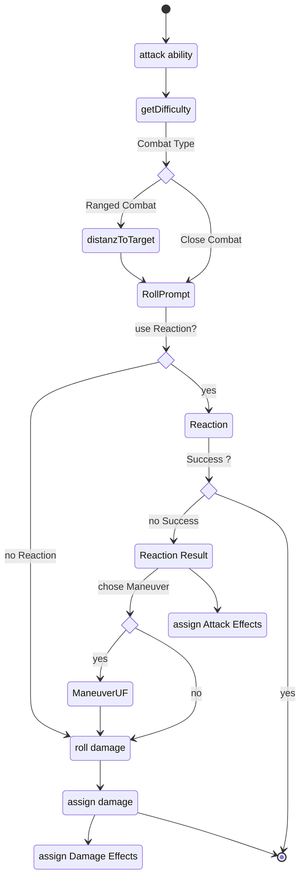

Reactions can be triggered from a chat message. The target gets have the option to roll reaction abilities (or standard reactions). the difficulty of these reactions is the result of the roll which lead to the reaction. The reaction triggers an ability test which, if successful will update the attack action and make it a failure.

### Diagram

### Related User Functions

[UC_Combat-attack](../Use%20Cases/UC_Combat-attack.md)

[UC_Combat-attack](../Use%20Cases/UC_Combat-attack.md)

[UF_Combat-rollAttack](../User%20Functions/UF_Combat-rollAttack.md)

[UC_ChatMessage-create](../User%20Functions/UC_ChatMessage-create.md)

[UC_ChatMessage-getHTML](../User%20Functions/UC_ChatMessage-getHTML.md)

[UC_ChatMessage-onCreate](../User%20Functions/UC_ChatMessage-onCreate.md)

[UC_ChatMessage-onReaction](../User%20Functions/UC_ChatMessage-onReaction.md)

[UC_ChatMessage-updateChatMessage](../User%20Functions/UC_ChatMessage-updateChatMessage.md)

[UC_Rolls-targetReactions](../User%20Functions/UC_Rolls-targetReactions.md)

[UC_Settings-automaticAmmunitionTracking](../User%20Functions/UF_Settings-automaticAmmunitionTracking.md)

[UC_Settings-automaticRangeCalculation](../User%20Functions/UF_Settings-automaticRangeCalculation.md)

### Related Test Coverage

| Test Coverage | Related Documentation |
|---------------|-----------------------|
| Attack all Actor types | [[Test - XXXXX]](https://github.com/patrickmohrmann/earthdawn4eV2/issues/) |
| Attack with Reaction | [[Test - XXXXX]](https://github.com/patrickmohrmann/earthdawn4eV2/issues/) |
| Attack with Maneuver | [[Test - XXXXX]](https://github.com/patrickmohrmann/earthdawn4eV2/issues/) |
| Attack with Missile | [[Test - XXXXX]](https://github.com/patrickmohrmann/earthdawn4eV2/issues/) |
| Attack with Throwing Weapon | [[Test - XXXXX]](https://github.com/patrickmohrmann/earthdawn4eV2/issues/) |
| Attack unarmed | [[Test - XXXXX]](https://github.com/patrickmohrmann/earthdawn4eV2/issues/) |
| Attack with substitude | [[Test - XXXXX]](https://github.com/patrickmohrmann/earthdawn4eV2/issues/) |
| Attack with Tail | [[Test - XXXXX]](https://github.com/patrickmohrmann/earthdawn4eV2/issues/) |

