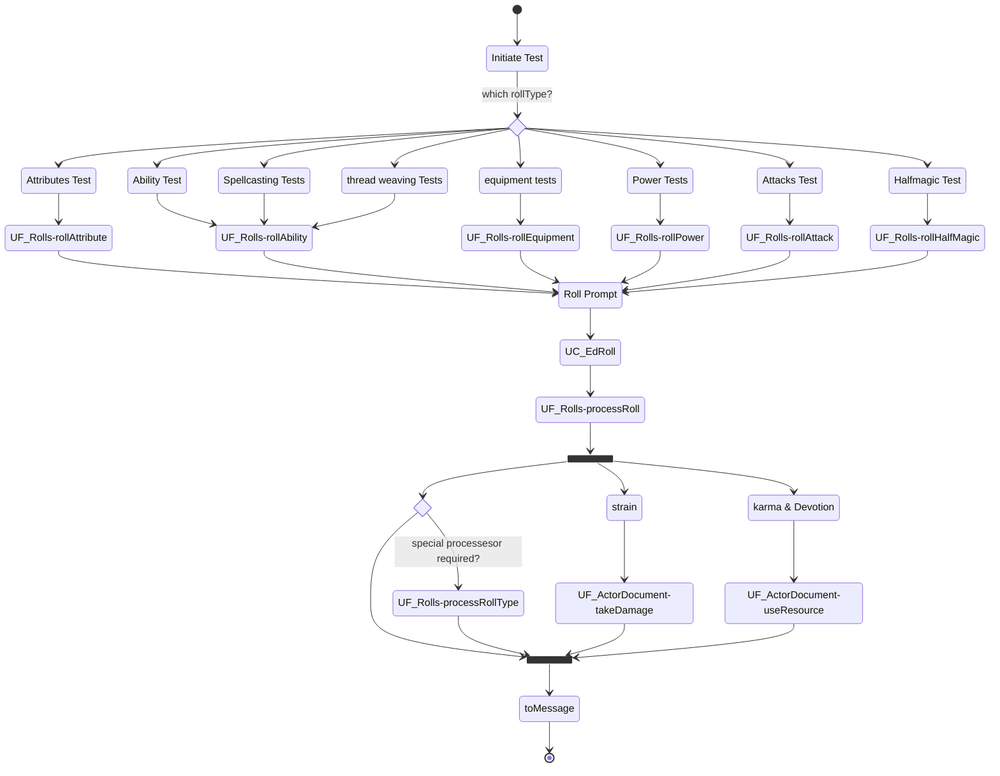

Tests in Earthdawn are considered to be one of two types. Either an **Action Test** or an **Effect Test**. With a virtual Table top in mind, there is also the option to just have an **arbitrary Test** which could be either. All three types are classified by the rollType configuration, which is based on the abilities, items or settings of such. Talents-, Skills- and Devotions tests are by default allways Action tests, Recovery and Damage Tests on the other hand are usually Effect tests. Arbitrary tests are neither of the above, but just rolls of a certain step number.

## Action Tests

Action Tests cover the following tests:
* Abilities
* Attacks
* Powers
* Attributes
* Half magic
* Spellcasting
* Thread weaving

those tests require a Difficulty Number (short DN) to cover all possibilities like special maneuvers or triggering effects or damage rolls. 

To have the DN, a target needs to be selected. Since it is easy for users to just roll any ability etc. it is not prohibited to just roll an ability without a target DN, in these cases, the system is just not supporting all related options.

Action tests rolled against a DN provide success and extra success or a failure information. 

Action Tests have a minimum DN of 2 no matter the amount of penalties.

### Diagram

### Related User Functions

[UF_Rolls-explodingDice](../User%20Functions/UF_Rolls/UF_Rolls-explodingDice.md)

[UF_Rolls-rollAttribute](../User%20Functions/UF_Rolls/UF_Rolls-rollAttribute.md)

[UF_Rolls-rollAbility](../User%20Functions/UF_Rolls/UF_Rolls-rollAbility.md)

[UF_Rolls-rollEquipment](../User%20Functions/UF_Rolls/UF_Rolls-rollEquipment.md)

[UF_Rolls-rollHalfMagic](../User%20Functions/UF_Rolls/UF_Rolls-rollHalfMagic.md)

[UF_Rolls-rollPower](../User%20Functions/UF_Rolls/UF_Rolls-rollPower.md)

[UF_Rolls-rollAttack](../User%20Functions/UF_Rolls/UF_Rolls-rollAttack.md)

### Related Test Coverage

| Test Coverage | Related Documentation |
|---------------|-----------------------|
| Roll Halfmagic | [[Test] - roll half magic](https://github.com/patrickmohrmann/earthdawn4eV2/issues/922) |
| Roll Halfmagic | [[Test] - roll half magic for multi disciplines](https://github.com/patrickmohrmann/earthdawn4eV2/issues/923) |
| Roll Attribute | [[Test] - roll Attributes](https://github.com/patrickmohrmann/earthdawn4eV2/issues/924) |
| Roll Talent | [[Test] - roll Talent](https://github.com/patrickmohrmann/earthdawn4eV2/issues/925) |
| Roll Skill | [[Test] - roll skill](https://github.com/patrickmohrmann/earthdawn4eV2/issues/926) |
| Roll Devotion | [[Test] - roll devotion](https://github.com/patrickmohrmann/earthdawn4eV2/issues/927) |
| Roll Power | [[Test] - roll power](https://github.com/patrickmohrmann/earthdawn4eV2/issues/928) |
| Roll Attack | [[Test] - roll attack](https://github.com/patrickmohrmann/earthdawn4eV2/issues/929) |
| Roll Equipment | [[Test] - roll Equipment](https://github.com/patrickmohrmann/earthdawn4eV2/issues/930) |
| Cast Spells | [[Test] - cast a Spell](https://github.com/patrickmohrmann/earthdawn4eV2/issues/931) |

