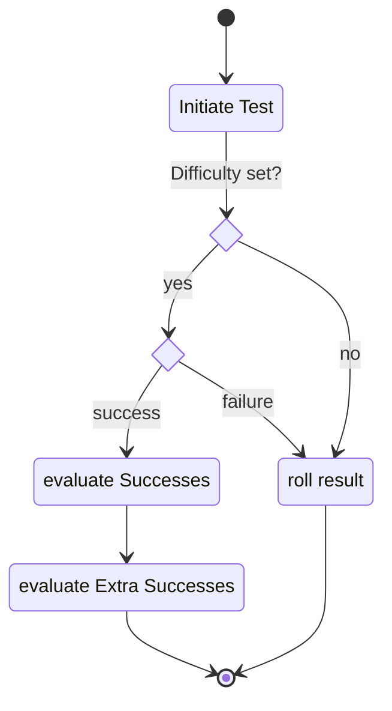

Tests in Earthdawn are considered to be one of two types. Either an **Action Test** or an **Effect Test**. With a virtual Table top in mind, there is also the option to just have an **arbitrary Test** which could be either. All three types are classified by the rollType configuration, which is based on the abilities, items or settings of such. Talents-, Skills- and Devotions tests are by default allways Action tests, Recovery and Damage Tests on the other hand are usually Effect tests. Arbitrary tests are neither of the above, but just rolls of a certain step number.

## Arbitrary Tests

Arbitrary tests are everything which can be either action or effect test. They provide success or failure information as well as extra successes if a target value is set or required, but otherwise just roll the appropriate step.

Arbitrary steps very often do not have an Actor or Item context. If a special step roll is needed for falling damage for example. the arbitrary step can easily be used for that. 

### Diagram

### Related User Functions

[UF_Rolls-explodingDice](../User%20Functions/UF_Rolls/UF_Rolls-explodingDice.md)

[UF_Rolls-triggerRollStep](../User%20Functions/UF_Rolls/UF_Rolls-triggerRollStep.md)

[UF_Journal-enichRoll](../User%20Functions/UF_Journal/UF_Journal-enichRoll.md)

[UF_Rolls-rollStepPrompt](../User%20Functions/UF_Rolls/UF_Rolls-rollStepPrompt.md)

### Related Test Coverage

| Test Coverage | Related Documentation |
|---------------|-----------------------|
| Roll from Journal | [[Test] - Roll from Journal](https://github.com/patrickmohrmann/earthdawn4eV2/issues/932) |
| Roll from Chat | [[Test] - roll from Chat](https://github.com/patrickmohrmann/earthdawn4eV2/issues/933) |
| Roll from Dice Symbol | [[Test] - System Setting Step tables](https://github.com/patrickmohrmann/earthdawn4eV2/issues/386) |

