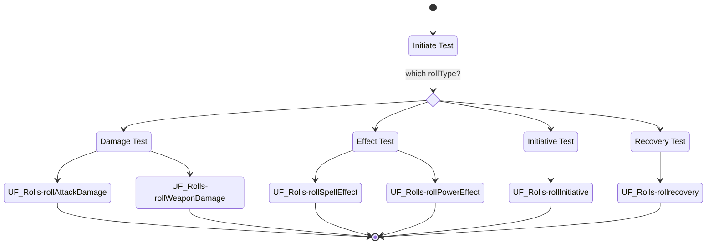

Tests in Earthdawn are considered to be one of two types. Either an **Action Test** or an **Effect Test**. With a virtual Table top in mind, there is also the option to just have an **arbitrary Test** which could be either. All three types are classified by the rollType configuration, which is based on the abilities, items or settings of such. Talents-, Skills- and Devotions tests are by default allways Action tests, Recovery and Damage Tests on the other hand are usually Effect tests. Arbitrary tests are neither of the above, but just rolls of a certain step number.
## Effect Tests

Effect Tests cover the following tests:
* damage
* effect
* Initiative
* recovery

Effect test don't have a difficulty number and do not require success or failure information as well as extra successes. The total amount of the roll is the result.

### Diagram

### Related User Functions

[UF_Rolls-explodingDice](../User%20Functions/UF_Rolls/UF_Rolls-explodingDice.md)

[UF_Rolls-rollWeaponDamage](../User%20Functions/UF_Rolls/UF_Rolls-rollWeaponDamage.md) --> not yet implemented

[UF_Rolls-rollAttackDamage](../User%20Functions/UF_Rolls/UF_Rolls-rollAttackDamage.md) --> not yet implemented

[UF_Rolls-rollSpellEffect](../User%20Functions/UF_Rolls/UF_Rolls-rollSpellEffect.md) --> not yet implemented

[UF_Rolls-rollPowerEffect](../User%20Functions/UF_Rolls/UF_Rolls-rollPowerEffect.md) --> not yet implemented

[UF_Rolls-rollInitiative](../User%20Functions/UF_Rolls/UF_Rolls-rollInitiative.md) --> not yet implemented

[UF_Rolls-rollRecovery](../User%20Functions/UF_Rolls/UF_Rolls-rollRecovery.md)

### Related Test Coverage

| Test Coverage | Related Documentation |
|---------------|-----------------------|
| Recovery of Stun damage | [[Test] - Recover stun damage](https://github.com/patrickmohrmann/earthdawn4eV2/issues/918) |
| Recovery of physical damage | [[Test] - Recover physical Damage](https://github.com/patrickmohrmann/earthdawn4eV2/issues/919) |
| Recovery of stun and physical damage | [[Test] - Recover stun and physical damage](https://github.com/patrickmohrmann/earthdawn4eV2/issues/920) |
| recovery of full night rest | [[Test] - Recover full night rest](https://github.com/patrickmohrmann/earthdawn4eV2/issues/921) |
| XXXXXXXX | [[Test] - XXXXXXXX](https://github.com/patrickmohrmann/earthdawn4eV2/issues/YYYYY) |
| XXXXXXXX | [[Test] - XXXXXXXX](https://github.com/patrickmohrmann/earthdawn4eV2/issues/YYYYY) |
| XXXXXXXX | [[Test] - XXXXXXXX](https://github.com/patrickmohrmann/earthdawn4eV2/issues/YYYYY) |
| XXXXXXXX | [[Test] - XXXXXXXX](https://github.com/patrickmohrmann/earthdawn4eV2/issues/YYYYY) |
| XXXXXXXX | [[Test] - XXXXXXXX](https://github.com/patrickmohrmann/earthdawn4eV2/issues/YYYYY) |
| XXXXXXXX | [[Test] - XXXXXXXX](https://github.com/patrickmohrmann/earthdawn4eV2/issues/YYYYY) |
| XXXXXXXX | [[Test] - XXXXXXXX](https://github.com/patrickmohrmann/earthdawn4eV2/issues/YYYYY) |

