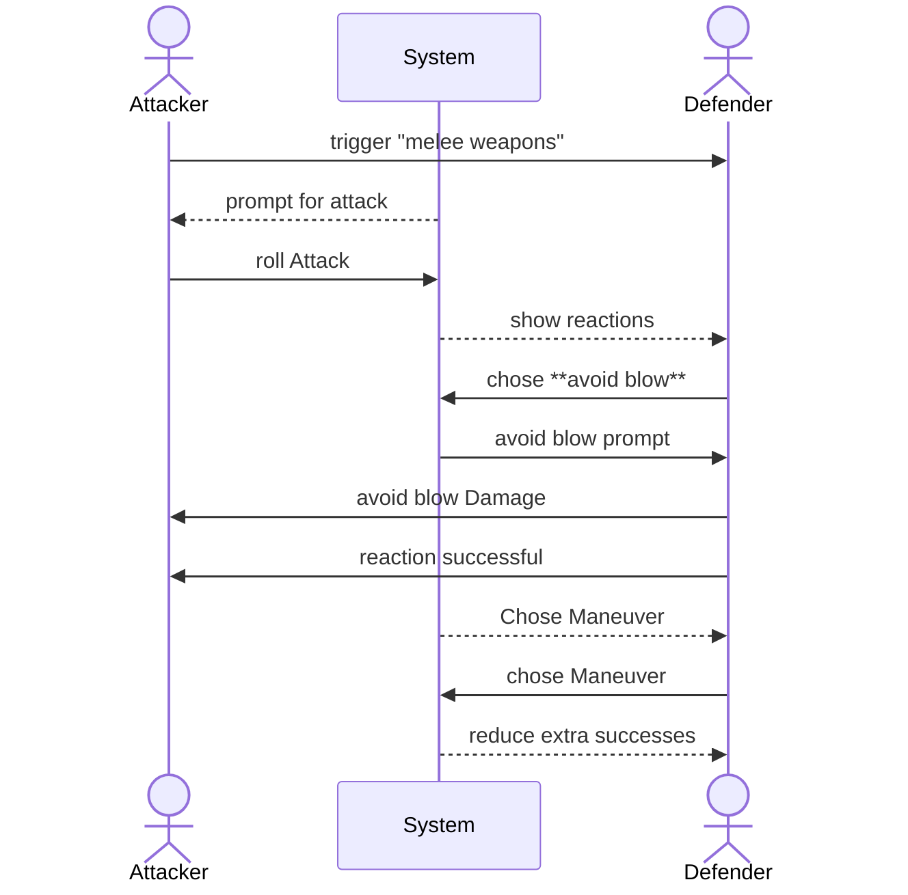

## Test description:

this test covers a simple close combat attack without any reaction or maneuver

## User Journey:

Actor1 <ACTOR1> is adjacent to Actor2 <ACTOR2> and has Actor2 <ACTOR2> targeted.  
On activating the ability *melee weapons* a roll prompt appears. 
After confirmation of the roll prompt a chat message is created showing information about the roll result (success, failure, extra successes etc.) 
The chat message contains two click options only usable by the GM or Actor2 <ACTOR2>. 
the options are **take the hit** and **use avoid Blow**. 
Actor2 <ACTOR2> choses **use avoid Blow** and by doing so, a roll prompt is created for Actor2 <ACTOR2> to roll **avoid Blow**. 
the difficulty of that roll is the result of the attack roll. 
the **avoid blow** roll is successful the Actor1 <ACTOR1> has the option to chose a maneuver.
Actor1 <ACTOR1> chose a maneuver and the extra successes of his reaction roll are reduced.

### Diagram:

### Prerequisites:

Actor1 <ACTOR1> and Actor2 <ACTOR2> exist.

Actor1 <ACTOR1> has the following items:
**Abilities**
* Talent-A <TALENT-A> (Melee Weapons) with *required Item Status* set to **main- or two-handed** and *Action Type* set to **Attack**.  
* Knack-Maneuver-A <KNACK-MANEUVER-A> (Harrying Attack) it is a maneuver knack linked to the Talent-A <TALENT-A>
* Item-A <ITEM-A> (Broadsword) has *weapon Type* set to **Melee** and a **no** range values set 

Actor2 <ACTOR2> has the following items:
* Talent-A <TALENT-A> (Avoid Blow) with *reaction Type* set to **physical Defense**.
* Knack-Maneuver-A <KNACK-MANEUVER-A> (Redirect Attack) it is a maneuver knack linked to the Talent-A <TALENT-A>

## Test:

| Test Instruction  | Expected Result  |
|---|---|
|   | <ul><li>- [ ] </li> <li>- [ ] </li></ul> |
|   | <ul><li>- [ ] </li> <li>- [ ] </li></ul> |
|   | <ul><li>- [ ] </li> <li>- [ ] </li></ul> |
|   | <ul><li>- [ ] </li> <li>- [ ] </li></ul> |
|   | <ul><li>- [ ] </li> <li>- [ ] </li></ul> |
|   | <ul><li>- [ ] </li> <li>- [ ] </li></ul> |
