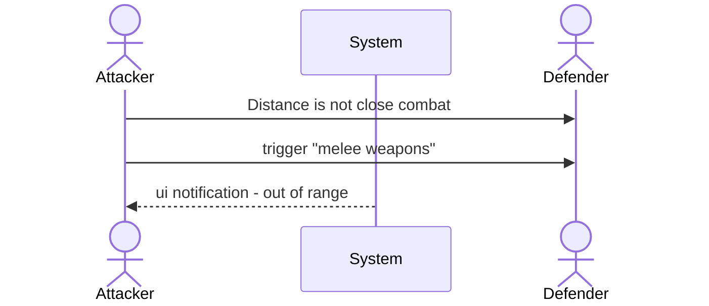

## Test description:

this test covers a simple close combat attack with the target out of range

## User Journey:

Actor1 <ACTOR1> is not adjacent to Actor2 <ACTOR2> and has Actor2 <ACTOR2> targeted.  
On activating the abilities *melee weapons* or *unarmed combat* a ui notification appears, informing about, that the target is out of range. 

### Diagram:

### Prerequisites:

Actor1 <ACTOR1> and Actor2 <ACTOR2> exist.

Actor1 <ACTOR1> has the following items:
**Abilities**
* Talent-A <TALENT-A> (Melee Weapons) with *required Item Status* set to **main- or two-handed** and *Action Type* set to **Attack**.  
* Item-A <ITEM-A> (Broadsword) has *weapon Type* set to **Melee** and a **no** range values set 

Actor2 <ACTOR2> has the following items:

## Test:

| Test Instruction  | Expected Result  |
|---|---|
|   | <ul><li>- [ ] </li> <li>- [ ] </li></ul> |
|   | <ul><li>- [ ] </li> <li>- [ ] </li></ul> |
|   | <ul><li>- [ ] </li> <li>- [ ] </li></ul> |
|   | <ul><li>- [ ] </li> <li>- [ ] </li></ul> |
|   | <ul><li>- [ ] </li> <li>- [ ] </li></ul> |
|   | <ul><li>- [ ] </li> <li>- [ ] </li></ul> |
