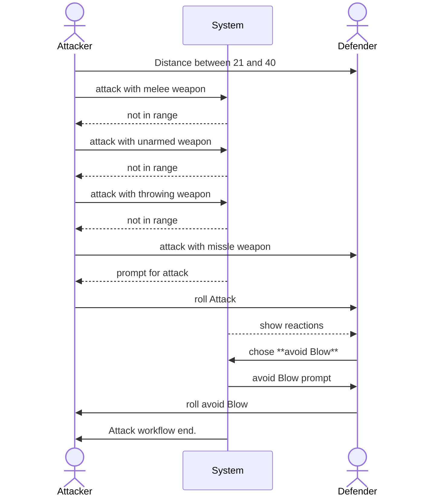

## Test description:

this test covers ranged attack at long range with a successful reaction

## User Journey:

Actor1 <ACTOR1> is at long rang (higher than the thrown weapon **long range max** value) to Actor2 <ACTOR2> and tries to hit him with melee, unarmed, thrown and missle weapons. Only the missle weapon has the possibility to hit the target. For the missle weapon a roll prompt appears, for all other, a Ui notification informs the user about that the distance is to high for his weapon. The missle weapon roll prompt shows a long range modifier of -2. After Actor1 <ACTOR1> confirms the roll prompt, the roll is executed (this process is repeated until it is a success). A chat message appears with the success information and two click options only to be used by Actor2 <ACTOR2> or the GM. one option is **take the hit** and the other one is **use avoid Blow**. Actor2 <ACTOR2> confirms the **avoid blow** option and therefore an **avoid blow** roll prompt appears for the Actor2 <ACTOR2>. Actor2 <ACTOR2> will confirm this prompt and **avoid blow** is rolled. A new chat message shows the success of the reaction and ends the attack workflow.

### Diagram:

### Prerequisites:

Actor1 <ACTOR1> and Actor2 <ACTOR2> exist.

Actor1 <ACTOR1> has the following items:
**Abilities**
* Talent-A <TALENT-A> (Melee Weapons) with *required Item Status* set to **main- or two-handed** and *Action Type* set to **Attack**.  
* Talent-B <TALENT-B> (unarmed Combat) with *required Item Status* set to **main- or two-handed** and *Action Type* set to **Attack**.
* Talent-C <TALENT-C> (throwing Weapons) with *required Item Status* set to **main- or two-handed** and *Action Type* set to **Attack**.
* Talent-D <TALENT-D> (Missile Weapons) with *required Item Status* set to **main- or two-handed** and *Action Type* set to **Attack**.
* Item-A <ITEM-A> (Broadsword) has *weapon Type* set to **Melee** and a **no** range values set 
* Item-B <ITEM-B> (Broadsword) has *weapon Type* set to **unarmed** and a **no** range values set 
* Item-C <ITEM-C> (Broadsword) has *weapon Type* set to **throwing/Melee** and a range values set to
  * short range min = 2
  * short range mage = 5
  * long range min = 6
  * long range max = 10
* Item-D <ITEM-D> (Broadsword) has *weapon Type* set to **throwing** and a range values set to
  * short range min = 2
  * short range mage = 5
  * long range min = 6
  * long range max = 10
* Item-E <ITEM-E> (Broadsword) has *weapon Type* set to **Missle** and a range values set to
  * short range min = 2
  * short range mage = 20
  * long range min = 21
  * long range max = 40

**Note** amunition is either not implemented, or the amount is high enough for this test to not interfere.

Actor2 <ACTOR2> has the following items:
* Talent-A <TALENT-A> (Avoid Blow) with *reaction Type* set to **physical Defense**.

| Test Instruction  | Expected Result  |
|---|---|
| Actor1 <ACTOR1> is at a distance between 21 and 40 of Actor2 <ACTOR2> and tries to attack with Talent-A <TALENT-A>. verify that: <ul><li>- an error notifiaction appears saying that the range is to big</li></ul> | <ul><li>- [ ] a Notification appears saying that the Range is to high.</li></ul> |
| Actor1 <ACTOR1> is at a distance between 21 and 40 of Actor2 <ACTOR2> and tries to attack with Talent-B <TALENT-B>. verify that: <ul><li>- an error notifiaction appears saying that the range is to big</li></ul> | <ul><li>- [ ] a Notification appears saying that the Range is to high.</li></ul> |
| Actor1 <ACTOR1> is at a distance between 21 and 40 of Actor2 <ACTOR2> and tries to attack with Talent-C <TALENT-C>. verify that: <ul><li>- an error notifiaction appears saying that the range is to big</li></ul> | <ul><li>- [ ] a Notification appears saying that the Range is to high.</li></ul> |
| Actor1 <ACTOR1> is at a distance between 21 and 40 of Actor2 <ACTOR2> and tries to attack with Talent-D <TALENT-D>. verify that: <ul><li>- the roll prompts opens with a modifier of **-2** </li></ul> | <ul><li>- [ ] A roll prompt appears with a modifier **-2** (for long range)</li></ul> |
| confirm the prompt (repeat until success) and verify that: <ul><li>- a roll is executed with a modifier of **-2** </li> <li>- two click options (Buttons) appear for Actor2 <ACTOR2>. **take the hit** and **avoid Blow** </li></ul> | <ul><li>- [ ] roll was executed with a modifier of **-2**</li> <li>- [ ] two click options for Ator2 <ACTOR2> are available. </li></ul> |
| Actor1 <ACTOR1> confirms the options with **avoid Blow** and verify that: <ul><li>- an **avoid Blow** test prompt opens for Actor2 <ACTOR2> </li><li>the difficulty of the **avoid Blow** prompt is the attack result.</li></ul>  | <ul><li>- [ ] the **avoid Blow** prompt opens </li> <li>- [ ] the difficulty is the attack result.</li></ul> |
| Actor2 <ACTOR2> confirms the **avoid Blow** prompt (repeat until success). Verify that: <ul><li>- the **avoid Blow** roll was executed with success</li></ul>  | <ul><li>- [ ] the reaction was successful. the Attack workflow ends. </li> </ul> |
