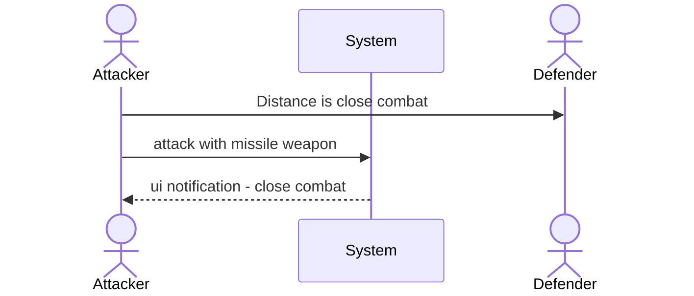

## Test description:

this test covers a simple missile combat attack within close combat range without any reaction or maneuver

## User Journey:

Actor1 <ACTOR1> is adjacent to Actor2 <ACTOR2> and has Actor2 <ACTOR2> targeted. 
On activating the abilities *missile Weapons* a ui notification appears, informing about, that the target is in close combat range.

### Diagram:

### Prerequisites:

Actor1 <ACTOR1> and Actor2 <ACTOR2> exist.

Actor1 <ACTOR1> has the following items:
**Abilities**
* Talent-A <TALENT-A> (Melee Weapons) with *required Item Status* set to **main- or two-handed** and *Action Type* set to **Attack**.  
* Talent-B <TALENT-B> (unarmed Combat) with *required Item Status* set to **main- or two-handed** and *Action Type* set to **Attack**.
* Talent-C <TALENT-C> (throwing Weapons) with *required Item Status* set to **main- or two-handed** and *Action Type* set to **Attack**.
* Talent-D <TALENT-D> (Missile Weapons) with *required Item Status* set to **main- or two-handed** and *Action Type* set to **Attack**.
* Knack-Maneuver-A <KNACK-MANEUVER-A> (Harrying Attack) it is a maneuver knack linked to the Talent-A <TALENT-A>
* Item-A <ITEM-A> (Broadsword) has *weapon Type* set to **Melee** and a **no** range values set 
* Item-B <ITEM-B> (Broadsword) has *weapon Type* set to **unarmed** and a **no** range values set 
* Item-C <ITEM-C> (Broadsword) has *weapon Type* set to **throwing/Melee** and a range values set to
  * short range min = 2
  * short range mage = 5
  * long range min = 6
  * long range max = 10
* Item-D <ITEM-D> (Broadsword) has *weapon Type* set to **throwing** and a range values set to
  * short range min = 2
  * short range mage = 5
  * long range min = 6
  * long range max = 10
* Item-E <ITEM-E> (Broadsword) has *weapon Type* set to **Missle** and a range values set to
  * short range min = 2
  * short range mage = 20
  * long range min = 21
  * long range max = 40

**Note** amunition is either not implemented, or the amount is high enough for this test to not interfere.

Actor2 <ACTOR2> has the following items:
* Talent-A <TALENT-A> (Avoid Blow) with *reaction Type* set to **physical Defense**.
* Knack-Maneuver-A <KNACK-MANEUVER-A> (Redirect Attack) it is a maneuver knack linked to the Talent-A <TALENT-A>

## Test:

| Test Instruction  | Expected Result  |
|---|---|
|   | <ul><li>- [ ] </li> <li>- [ ] </li></ul> |
|   | <ul><li>- [ ] </li> <li>- [ ] </li></ul> |
|   | <ul><li>- [ ] </li> <li>- [ ] </li></ul> |
|   | <ul><li>- [ ] </li> <li>- [ ] </li></ul> |
|   | <ul><li>- [ ] </li> <li>- [ ] </li></ul> |
|   | <ul><li>- [ ] </li> <li>- [ ] </li></ul> |
